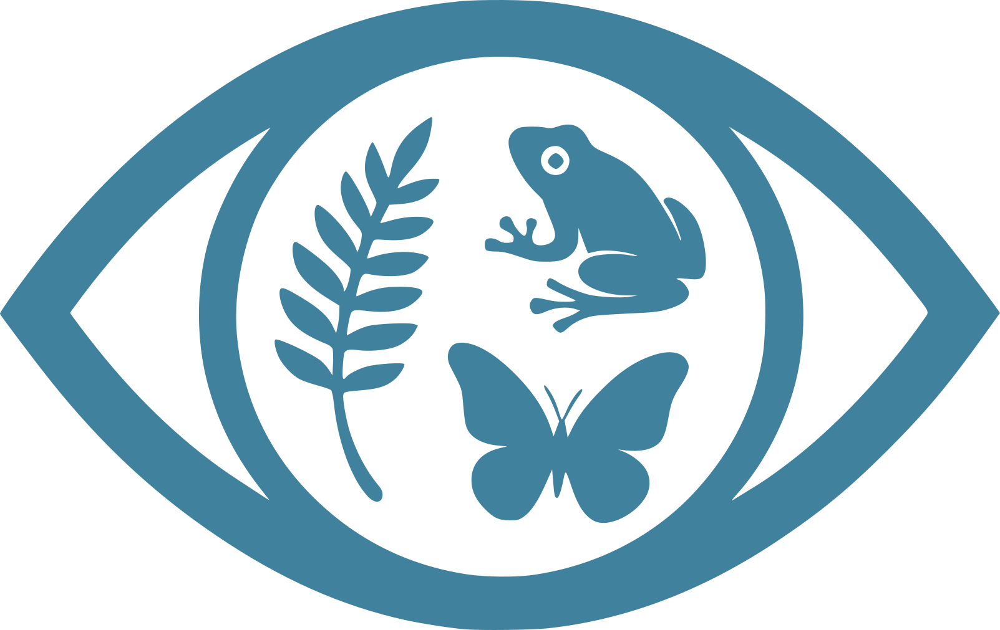

# Hidden Biodiversity Tracker

  

**Hidden Biodiversity Tracker** is an interactive Shiny app that showcases examples of biodiversity that are often overlooked or underrepresented in research, conservation, and public awareness. These examples are categorized across multiple dimensions — **taxonomic**, **functional**, **genetic**, **spatial**, **temporal**, **methodological** and **social** — and visualized using intuitive tools designed to reveal complex patterns in biodiversity data.

## Explore Hidden Biodiversity

- **Interactive Map** — Navigate a dynamic map to explore where hidden biodiversity examples have been reported or observed.
- **Sunburst Chart** — Visualize how cases of hidden biodiversity relate to different dimensions and contexts, providing a multi-layered view of underrecognized life forms.

## Contribute Your Knowledge

Have an example of hidden biodiversity? Help us build a richer, more inclusive understanding of life on Earth by contributing:

- Click the **gear icon** ⚙️ at the top right of the screen.
- Submit your example directly through the app.
- Your submission will be reviewed and added to the growing collection.

